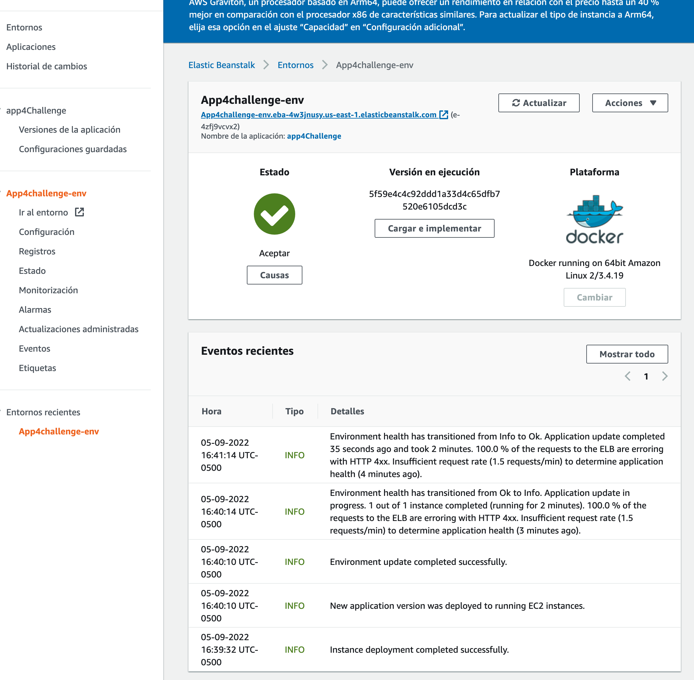
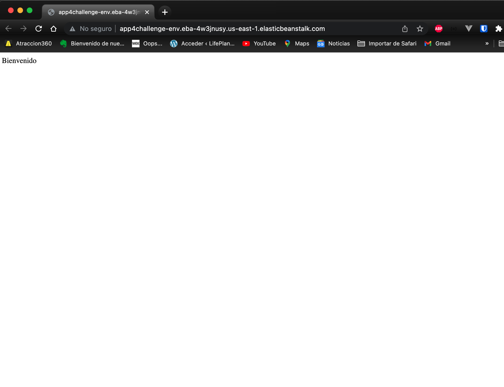

# Solución a challenge 4 de CI/CD

## Práctica 1

Dado este proyecto en NodeJS, crea su Dockerfile sabiendo que nos han pedido como imagen base ubuntu:18.04, versión 16 de NodeJS, el 8888 será el puerto donde exponga la comunicación la applicación, la señal de STOP debe llegarle a la aplicación y el contenedor podría ser iniciado con cualquier proceso.

- Contruccion del dokerfile

```docker
FROM ubuntu:18.04

WORKDIR /usr/src/app

COPY ./ /usr/src/app/

RUN apt update \
    && apt upgrade \
    && apt install -y curl \
    && curl -fsSL https://deb.nodesource.com/setup_16.x | bash \
    && apt install nodejs -y \
    && node -v \
    && npm install

EXPOSE 8888

CMD ["sh", "-c", "date ; npm start "]
```

- Ejecución del contenedor en local

```
docker run -ti --rm -p 8888:8888 backend-node

```

## Práctica 2

Sube la imagen de Docker a DockerHub.

```
docker login
docker tag backend-node jorgels120878/app-node:V1.0
docker push jorgels120878/app-node:V1.0
```

## Práctica 3

Automatiza el proceso de creación de la imagen de Docker y su subida a Docker Hub después de cada cambio en el repositorio utitlizando Github Actions.

-En segida el archivo YAML de las acciones

```
# This workflow uses actions that are not certified by GitHub.
# They are provided by a third-party and are governed by
# separate terms of service, privacy policy, and support
# documentation.

on:
  #  schedule:
  #    - cron: '31 22 * * *'
  push:
    branches: ["main"]
    # Publish semver tags as releases.
    tags: ["v*.*.*"]
#  pull_request:
#   branches: [ "main" ]

env:
  # Use docker.io for Docker Hub if empty
  REGISTRY: docker.io
  # github.repository as <account>/<repo>
  IMAGE_NAME: app-node-bootcamp-4-challenge

jobs:
  init:
    runs-on: ubuntu-latest
    strategy:
      matrix:
        node-version: [16.x]
    steps:
      - uses: actions/checkout@v3
      - name: Use Node.js ${{ matrix.node-version }}
        uses: actions/setup-node@v3
        with:
          node-version: ${{ matrix.node-version }}
          cache: "npm"
      - run: npm install
      - run: npm test

  build:
    runs-on: ubuntu-latest
    needs: init
    permissions:
      contents: read
      packages: write
      # This is used to complete the identity challenge
      # with sigstore/fulcio when running outside of PRs.
      id-token: write

    steps:
      - name: Checkout repository
        uses: actions/checkout@v3

      # Workaround: https://github.com/docker/build-push-action/issues/461
      - name: Setup Docker buildx
        uses: docker/setup-buildx-action@79abd3f86f79a9d68a23c75a09a9a85889262adf

      # Login against a Docker registry except on PR
      # https://github.com/docker/login-action
      - name: Log into registry ${{ env.REGISTRY }}
        if: github.event_name != 'pull_request'
        uses: docker/login-action@28218f9b04b4f3f62068d7b6ce6ca5b26e35336c
        with:
          registry: ${{ env.REGISTRY }}
          username: ${{ secrets.DOCKERHUB_USERNAME }}
          password: ${{ secrets.DOCKERHUB_TOKEN }}

      # Build and push Docker image with Buildx (don't push on PR)
      # https://github.com/docker/build-push-action
      - name: Build and push Docker image
        id: build-and-push
        uses: docker/build-push-action@ac9327eae2b366085ac7f6a2d02df8aa8ead720a
        with:
          context: .
          push: ${{ github.event_name != 'pull_request' }}
          tags: ${{ secrets.DOCKERHUB_USERNAME }}/${{ env.IMAGE_NAME }}:latest

```

## Práctica 4

Se debe crear una aplicación en Heroku y desplegarla allí usando github actions.

Realice el despliege en AWS , en segida se muestran las acceiones, la aplicacion en AWS y el resultado del despliege.

```
eploy_aws:
    runs-on: ubuntu-latest
    needs: build
    steps:
      - uses: actions/checkout@v3
      - name: Generate deployment package
        run: zip -r deploy.zip . -x '*.git*'
      - name: Deploy to EB
        uses: einaregilsson/beanstalk-deploy@v20
        with:
          aws_access_key: ${{ secrets.AWS_ACCESS_KEY_ID }}
          aws_secret_key: ${{ secrets.AWS_SECRET_ACCESS_KEY }}
          application_name: app4Challenge
          environment_name: App4challenge-env
          version_label: ${{ github.sha }}
          region: us-east-1
          deployment_package: deploy.zip

```




